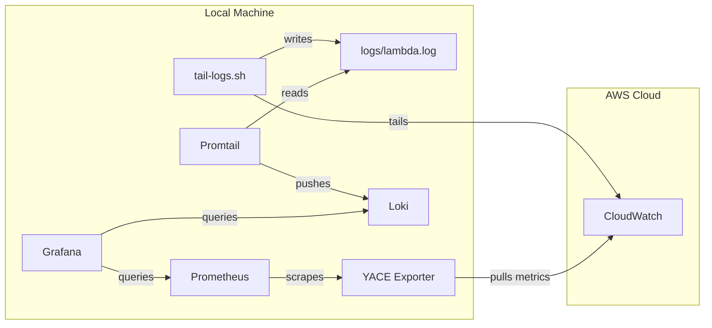

# 📊 Serverless Monitoring Stack

A complete observability stack for local development, combining Metrics (Prometheus) and Logs (Loki) in one Grafana Dashboard.

## Architecture



## Stack Components

| Service | Port | Description |
|---------|------|-------------|
| **Grafana** | `3000` | Visualization Dashboard (User: `admin`/`admin`) |
| **Prometheus** | `9090` | Timeseries Database (Metrics) |
| **Loki** | `3100` | Log Aggregation System (Logs) |
| **YACE** | `5001` | CloudWatch Metrics Exporter |
| **Promtail** | N/A | Log Shipper (sends logs to Loki) |

## Prerequisites

*   Docker & Docker Compose installed.
*   AWS CLI v2 installed and configured (`aws configure`).
*   Verify credentials in `~/.aws/credentials`.

## Setup & Run

### 1. Start the Backend Stack
Run the Docker containers (Grafana, Prometheus, Loki, etc.):

```bash
cd monitoring
docker-compose up -d
```

### 2. Start Log Shipping (Important!)
To see real-time logs from AWS, you must run the tailing script in a **separate terminal**. This script pulls logs from CloudWatch and writes them to a file that Promtail watches.

```bash
# In project root
./tail-logs.sh
```
*Keep this terminal open while you develop.*

### 3. Configure Grafana (First Time Only)

1.  **Login**: [http://localhost:3000](http://localhost:3000) (admin/admin).
2.  **Add Prometheus Data Source**:
    *   URL: `http://prometheus:9090`
    *   Click **Save & Test**.
3.  **Add Loki Data Source**:
    *   URL: `http://loki:3100`
    *   Click **Save & Test**.

## Usage

*   **View Metrics**: Create a dashboard and query Prometheus (e.g., `yace_cloudwatch_invocations_sum`).
*   **View Logs**: Go to **Explore** -> Select **Loki** -> Query `{job="lambda"}`.

## Cleanup

To stop all containers:
```bash
cd monitoring
docker-compose down
```
