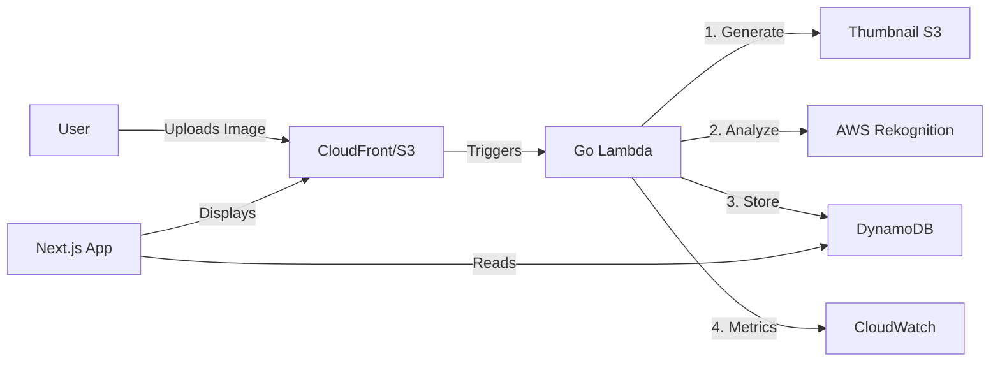

# Serverless Image Processing & Analytics

A Full Stack Serverless application combining **Next.js**, **AWS Lambda**, **Rekognition**, and **DynamoDB** to process, analyze, and visualize images.

## Architecture



## Features

- **Frontend**: Next.js 14 (App Router) with beautiful UI & Glassmorphism design.
- **Image Processing**:
  - Auto-generate **300px thumbnails** for fast loading.
  - Detect objects/labels algorithmically using **AWS Rekognition**.
- **Security**:
  - **Rate Limiting**: 5 uploads/minute per IP.
  - **Validation**: Strict strict JPG/PNG MIME type checks.
  - **Access Control**: Least privilege IAM policies.
- **Observability**: Custom CloudWatch metrics for latency, upload success/failure, and rate limits.
- **Infrastructure as Code**: Fully managed via **Terraform**.
- **CI/CD**: Automated testing & deployment with **GitHub Actions**.

## Project Structure

```bash
.
├── frontend/        # Next.js Application
├── terraform/       # Infrastructure as Code (AWS)
├── .github/         # CI/CD Workflows
├── main.go          # Lambda Function (Go)
└── Makefile         # Build commands
```

## Getting Started

### Prerequisites
- Go 1.21+
- Node.js 18+
- AWS CLI & Terraform

### Deployment

**Option 1: Automated (Recommended)**
Push to `main` branch. GitHub Actions will:
1. Test & Build Go Lambda.
2. Terraform Apply infrastructure changes.

**Option 2: Manual**
```bash
# 1. Backend & Infra
make deploy

# 2. Frontend
cd frontend && vercel --prod
```

## Environment Variables

| Component | Variable | Description |
|-----------|----------|-------------|
| **Lambda** | `DYNAMODB_TABLE_NAME` | Table to store metadata |
| **Frontend** | `AWS_REGION` | AWS Region (ap-southeast-2) |
| | `S3_BUCKET_NAME` | Source bucket name |
| | `CLOUDFRONT_DOMAIN` | CDN Domain for assets |

## License
MIT
