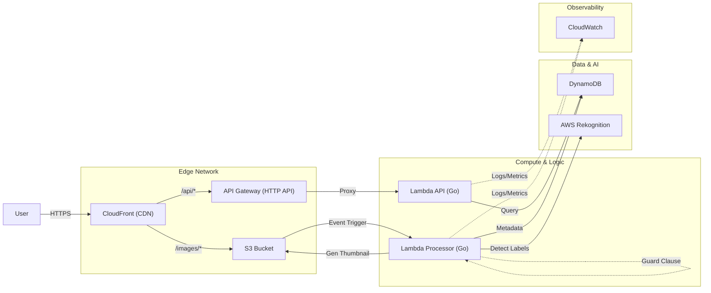

# Serverless Image Processing & Analytics

A High-Performance Serverless System built with **AWS**, **Go**, and **Terraform**. It leverages Event-Driven Architecture to process, analyze, and visualize images in real-time.

## Architecture

The system follows a strict **Cloud-Native** flow with **Defense in Depth** security.



**Data Flow:**
1.  **Request**: User requests travel through **CloudFront** (Caching & SSL).
2.  **API Routing**: CloudFront routes `/api` requests to **API Gateway**, which invokes the **Lambda API**.
3.  **Upload**: User gets a Presigned URL from Lambda API, then uploads directly to **S3**.
4.  **Processing**: S3 "Object Created" event triggers the **Lambda Processor**.
    *   Validates file type.
    *   Generates 300px thumbnail.
    *   Invokes **AWS Rekognition** for label detection.
    *   Saves metadata to **DynamoDB**.
5.  **Protection**: Includes "Deep Guard" logic to prevent recursive S3 loops (ignoring thumbnails).

## Features

-   **🚀 Ultra-Fast API**: Built with **Go** running on AWS Lambda (ARM64).
-   **🛡️ Security First**:
    -   **CloudFront OAC**: S3 is not public; access strictly via CloudFront.
    -   **Upload Limits**: Validates file size (< 5MB) on both Client and Server.
    -   **Loop Prevention**: Smart filtering prevents infinite S3 recursion.
-   **💾 Smart Storage**:
    -   **Presigned URLs**: Secure, temporary access to private objects.
    -   **Terraform Remote Backend**: State stored in S3 with DynamoDB Locking.
-   **🧠 AI Powered**: Automatic object detection using AWS Rekognition.
-   **📜 Pagination**: Infinite scroll support with optimized DynamoDB scanning.
-   **🎨 UI/UX**: "Sci-Fi" scanning animation and glassmorphism design.

## Project Structure

```bash
.
├── api/             # Lambda Function (API Handler)
├── cmd/             # Utility Scripts (Cleanup, etc.)
├── frontend/        # Frontend Client (Next.js)
├── terraform/       # Infrastructure as Code (AWS)
└── main.go          # Lambda Function (Image Processor)
```

## Deployment

### Automated (GitHub Actions)
Fully automated CI/CD pipeline:
1.  **Build**: Compiles Go binaries.
2.  **Infra**: Terraform Plan & Apply (State stored in S3).
3.  **Deploy**: Updates Lambda code individually.

### Manual
```bash
# Deploy Infrastructure & Backend
make deploy

# Cleanup S3 & DynamoDB (dev only)
make clean-data
```

## Environment Variables

| Component | Variable | Description |
|-----------|----------|-------------|
| **Frontend** | `NEXT_PUBLIC_API_URL` | CloudFront Distribution URL |
| **Backend** | `DYNAMODB_TABLE_NAME` | Table name for metadata |
| | `S3_BUCKET_NAME` | S3 Bucket name |

## License
MIT
